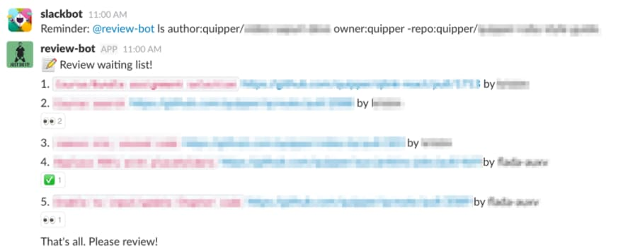
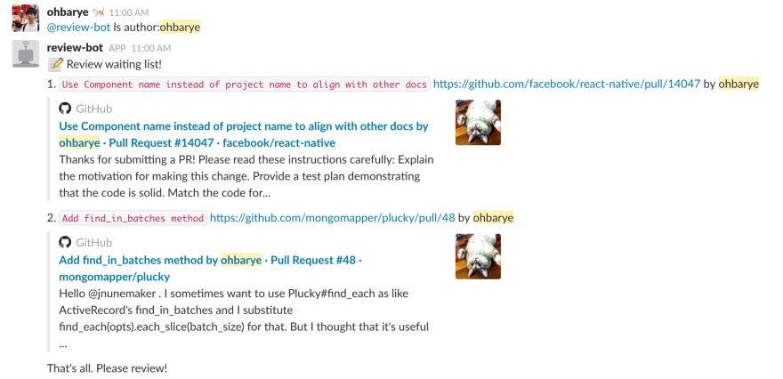

<!-- $theme: gaia
template: invert -->


レビューを加速させる
仕組みづくり
===


###### Pull Requests を Slack に通知する bot を活用する

###### by Masato Ohba ( [@ohbarye](https://github.com/ohbarye) )

---

<!-- page_number: true -->

<!-- footer: レビューを加速させる仕組みづくり -->

# 本日の内容について

---

#### お話すること

- [review-waiting-list-bot](https://github.com/ohbarye/review-waiting-list-bot) (以下、review-bot) という Slack bot を作った話
- 同 bot の活用事例

#### 参考記事

- [レビュー待ちの Pull Request 一覧を Slack に定期的に通知する -valid,invalid-](http://ohbarye.hatenablog.jp/entry/2017/08/26/230421)

- [Show pull requests awaiting review on Slack periodically -dev.to-](https://dev.to/ohbarye/show-pull-requests-awaiting-review-on-slack-periodically-23h)
	- tip: 英語で記事を書くと star 増える

---

# review-bot とは？

---

## review-bot

- Node.js 製の Slack bot。フレームワークは [botkit](https://github.com/howdyai/botkit)
- メンションされると GitHub API を叩いて pull requests を収集し、まとめて Slack に post する
- author, owner, repo, label などで絞込
- 除外条件 (exclusion) も書ける

```
@review-bot ls author:org/my-team owner:org -repo:design
```

- 詳しくは [README](https://github.com/ohbarye/review-waiting-list-bot/blob/master/README.md) 参照

---

## review-bot

- ローカル、Heroku、Docker などで動かせる
- お試ししたいなら Docker が楽

```sh
$ docker pull ohbarye/review-waiting-list
$ docker run \
  -e SLACK_BOT_TOKEN=your-slack-bot-token \
  -e GITHUB_AUTH_TOKEN=your-github-auth-token \
  ohbarye/review-waiting-list-bot
```

- 運用は Heroku が楽
	- worker process だけなので [無料枠](https://devcenter.heroku.com/articles/free-dyno-hours#dyno-sleeping) (free dyno) で OK だし、眠らない

<!-- Demo? -->

---

## Demo: private



<!-- Reaction でコミュニケーションする"エンジニアしぐさ" -->

---

## Demo: public



<!-- Slack がリンクを勝手に展開してくれて fabulous -->

---

# Use cases

---

## 1. 定期的にリストアップ

---

## 方法

- review-bot に定期実行機能は実装していない
	- 設定を持つのは複雑化の一歩、ソフトウェアはシンプルに作って組み合わせる
- Slack の [Reminder](https://get.slack.help/hc/ja/articles/208423427-%E3%83%AA%E3%83%9E%E3%82%A4%E3%83%B3%E3%83%80%E3%83%BC%E3%82%92%E8%A8%AD%E5%AE%9A%E3%81%99%E3%82%8B) 機能を使う

```sh
/remind #general 
 “@review-bot ls author:org/team
  owner:ohbarye 
  repo:ohbarye/review-waiting-list-bot,rails/rails”
 at 11am every weekday
```

---

### 効能

- アウトプットが可視化される
- チームのレビュータイムを決めてしまうことで開発に"リズム"が生まれる
- bot を呼ぶチャンネルを開発者以外も見ている場合、彼らに伝わるものがある
	- 「おっ、やっとるな」
	- 「レビュー大変そうだな」
	- 「こんな仕事もやっているんだな」

---

## 2. daily meeting で確認

---

## 方法

- daily meeting の終わりに bot を呼んで進捗確認


## 効能

- 対面の場で状況を確認しあうと、コミュニケーションが生まれる
- 「この PR について質問してもよいですか？」
- 「来週リリースに必要なのはコレとコレなので優先的にレビューしていきましょう」

---

## まとめ

- review は開発者のタスクの中でも 1, 2 を争うほど大事
	- だからこそ気持ちよくやりたい
- 可視化したりリズムを作るのに review-bot はなかなか役立つ
- チームに合わせた使い方をしてみては

---

## 自己紹介

<!-- 時間があれば -->

 

@ohbarye : Web developer

Working for [Quipper](https://www.quipper.com/)

http://ohbarye.me/

---

# 完
