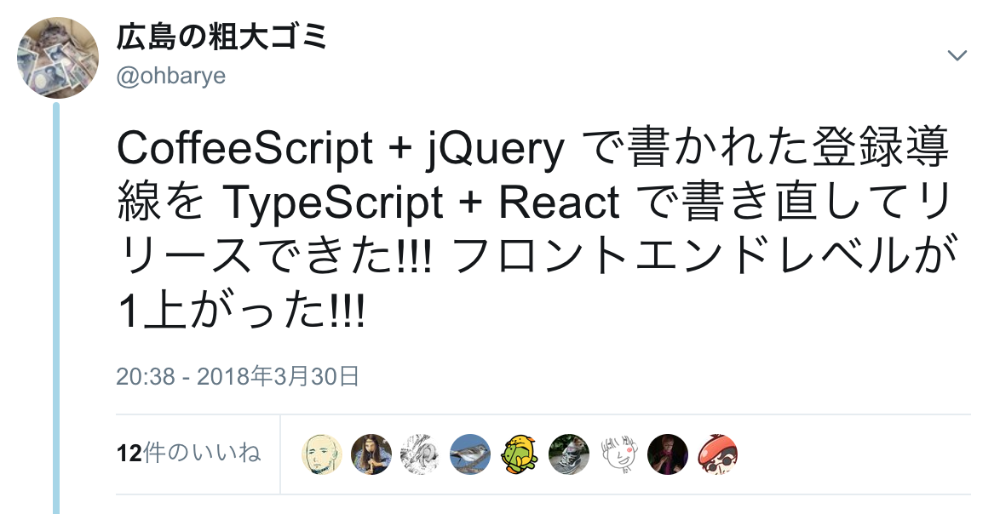
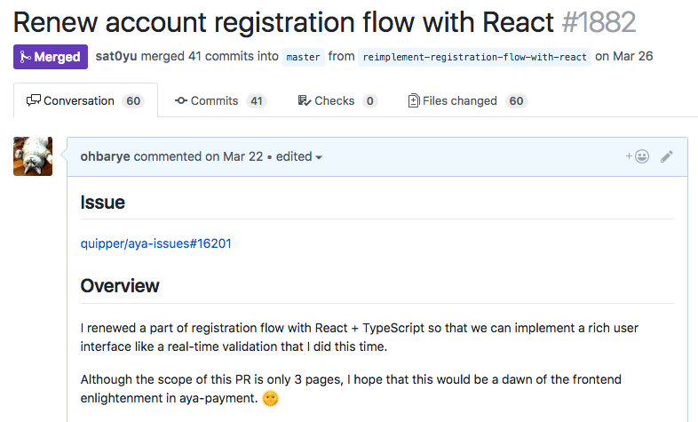

<!-- $theme: gaia
template: invert -->

フロントエンドのレベル上げ
===

#### Rails エンジニアが Webpacker を使う場合

##### by [@ohbarye](https://github.com/ohbarye) at Meguro.rb#15

---

<!-- page_number: true -->

<!-- footer: フロントエンドのレベル上げ -->

# 本日の内容について

# 

<!-- このたびレベルが上がりました -->

---

# Content

0. Webpacker とは？
1. なぜレベルアップする必要があったのか
2. Railsフロントエンドのモダン化
3. Webpacker pros/cons

<!-- 10分なので0~2はサクサクいきたい -->

---

<!-- その前に -->

# 0. Webpacker とは？

---

# Webpacker おさらい

- [Webpacker](https://github.com/rails/webpacker) は Webpack と Rails を統合する gem
- コマンド数発でいきなり ES6, TypeScript, React で Rails のフロントエンド開発を始められる
- config ファイルも開発用と本番用を生成
- Rails organization で開発されている

- => 本当に良いツールか？という問には後半で振り返る<!--この時点でフラグ立ってるけど-->

---

# 1. なぜレベルアップする必要があったのか

---

## "front-end complex"

- React, TypeScript が社内で標準になる流れ
- [React Native 人材になっていく同僚たち](http://quipper.hatenablog.com/entry/2017/12/05/114014)
- 

<!-- Engineering Manager として部下のフロントエンドスキルを評価できないのはまずい -->
<!-- ある種の後悔は取り戻すことができる 『エアマスター』 -->

---

## ビジネスとして

- 当時担当の web アプリは決済サイト (＋登録導線)
	- 決済は堅牢であることが最も大事
	- 一方、このサイト内の登録導線は CVR に直結
- フロントエンドは Rails おなじみのスタック
	- jQuery + CoffeeScript
- 拡張が苦しく、複雑な仕様やA/Bテストに対応するには作り直したほうが早い

<!-- と言ってもjQueryによる導線は半年前に自分で作った -->
<!-- 予想以上に変更頻度が高く、負債具合が加速 -->
<!-- マルチステップ登録フォームってドメインロジックバリバリになりがち -->

---

# 2. Railsフロントエンドの
# モダン化

---

## step1: Introduce Webpacker

- 手始めに Webpacker を install
	- CircleCI で使う docker image を更新
	- 同僚 [@mtsmfm](https://twitter.com/mtsmfm) が `docker compose up` で webpack-dev-server も立ち上がるようにしてくれた
- [Heroku Buildpack を使ったデプロイで躓いた](http://ohbarye.hatenablog.jp/entry/2017/11/18/015048)が、バックエンドの知識でなんとかなった

---

## step2: Code migration

- Webpacker 管理下にファイルを移動 (rm manifest)
	- app/assets/javascripts => app/javascripts
- asset pipeline gem を npm ライブラリに置換
- CoffeeScript を TypeScript に書き換え <!-- decaffeinate -->
- 

---

## step2: Code migration

- できる人ならこうした設定なども一瞬で終わるかもしれないが、それでは自分の学びにならない
- 一方、足回りを独力でちまちま進めているといつまでもマージされない、リリースされない
	- リリースされないコードに価値はない...
- 緩やかな移行を実現できたので、**スコープを絞りながら学ぶことが出来た**

---

## step3: SPA

- Partial single page application パターンで実装 <!-- 勝手に命名。既に名前あったら知りたい -->
	- 登録導線の数画面だけを SPA として実装
	- AWS のマネジメントコンソールも P-SPA
- 単なる書き直しでなくCVR向上のための機能追加を約束
-  <!-- テンション上がっている様子 -->

---

## step3: SPA

- 登録画面の数画面のためだけに Redux は不要
- [formik](https://github.com/jaredpalmer/formik)
	- 揮発性の高い form データを扱う
	- Dan Abramov 先生が2017/12に[言及](https://dev.to/dan_abramov/comment/1n82)
- [yup](https://github.com/jquense/yup)
	- validation rule を宣言的に定義
	- JSON schema 的

---

## Successfully merged & shipped

# 

---

# 3. Webpacker pros/cons

---

## Pros

- ハッシュ付きファイル名の自動生成 <!--キャッシュ対策、Sprockets と同じ感覚で運用-->
- `rake assets:precompile` にフックしてビルド (`webpacker:compile`) が行われる
	- Sprockets を使っていない場合は `assets:precompile` の alias になる
	- 既存のビルドシステムやアセット管理が活きる

---

## Cons

- Webpacker 固有の知識が求められる
	- webpacker.yml, watched_paths etc.
	- Ruby 経由で webpack を実行する問題 <!-- e.g. 環境変数の受け渡し -->
- webpack v4 が出ても Webpacker が対応するまでアップデートできない
	=> 既視感… asset pipeline と同じ話では…？<!--gem が更新されないと npm library をアップデートできない-->

- 余計なレイヤーが1つ増えたとも言える

---

## Webpacker Philosophy

- [公式レポジトリに届いたお便り](https://github.com/rails/webpacker/issues/1371)への回答
- 開発者の幸福にフォーカスしている

	> But the most important benefit that we often overlook is our happiness and experience as programmers. If things are integrated and part of one workflow, then it leads to better and happy work. I guess that's what been the mantra of Rails stack - to provide integrated systems that work together.

---

## Webpacker is momentum builder

- "simple" ではなく "easy" を体現するツール <!--Rails同様-->
- [Simple is not easy](http://ohbarye.hatenablog.jp/entry/2017/11/30/012726)

	> 「Easy」は勢いを生み出すものです。「Easy」によって早期に得られる低リスクの成功体験は継続へとつながるでしょう。

---

## When to use, when **NOT** to use

- Q. 結局 Webpacker って必要？

- A. 個人的な見解は…
	- 既存プロジェクトのゆるやかな移行用途
	- フロントエンドに詳しいエンジニアなら不要
	- 速度重視かつ短期の個人開発ならあり

---

## Webpacker 関連 良記事

<!-- より詳しく知りたい方はこちら -->

- Introducing Webpacker
	https://medium.com/statuscode/introducing-webpacker-7136d66cddfb
- How we switched from Sprockets to Webpack
	https://rossta.net/blog/from-sprockets-to-webpack.html
- 【保存版】Rails 5 Webpacker公式ドキュメントの歩き方+追加情報
	https://techracho.bpsinc.jp/hachi8833/2018_05_17/56568

---

## 今後

- 卒業宣言「Webpacker は補助輪」
- 
- `webpacker:eject` 的なコマンドがほしい <!-- create-react-app -->
<!-- - [euxn23/webpacker-pure-config](https://www.slideshare.net/euxn/20180522-can-i-go-along-with-webpacker-frontendonrails) という選択肢も? リブセンス社-->
- sass も webpack で管理したい

---

## まとめ

- <!--フロントエンド周回遅れRailsエンジニアでも-->Webpackerを用いたRailsフロントエンドモダン化を通じてレベルアップできた
- レベルアップと同時にビジネスにも貢献
	- **CVR 2.6% up (局所的には 7.2% up)**
- 開発を通じて周辺エコシステムに興味・関心++
	- GitHub trending で JS, TS もウォッチするように
	- node.js, yarn, DefinitelyTyped, Webpacker, formik etc. に contribute できた

<!--node v10.2.0 on 2018/05/23-->
<!--yarn v1.7.0 on 2018/05/24-->

---

## 自己紹介

<!-- 時間があれば -->

@ohbarye : Web Developer / Engineering Manager

Working for [Quipper](https://www.quipper.com/) (we're hiring!)

http://ohbarye.me/

---

# 完
