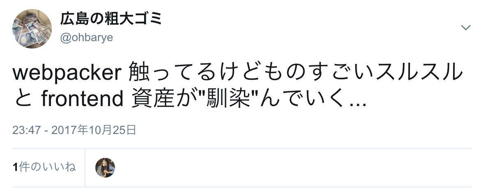
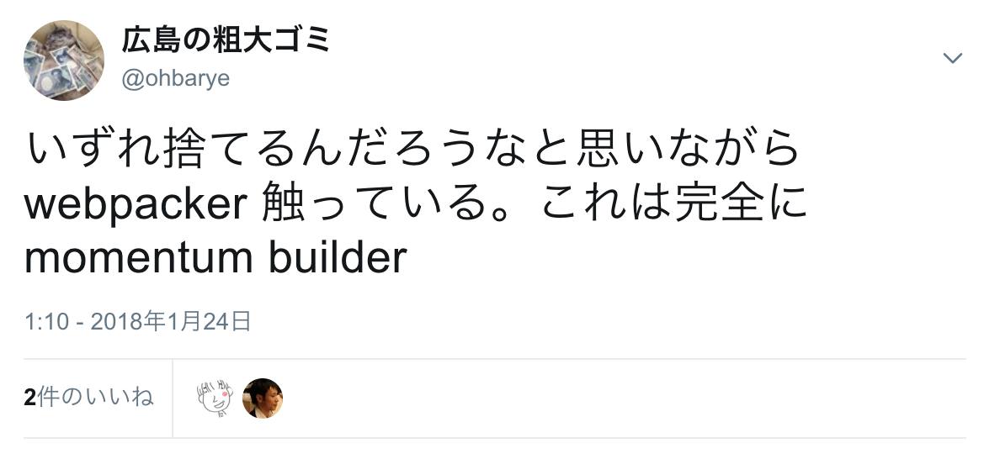

<!-- $theme: gaia
template: invert -->

フロントエンドのレベル上げ
===

##### Rails エンジニアが Webpacker を使う場合

###### by [@ohbarye](https://github.com/ohbarye)

###### @Meguro.rb#15

---

<!-- page_number: true -->

<!-- footer: フロントエンドのレベル上げ -->

# 本日の内容について

---

#### Content

1. Why should I level up?
2. How can I obtain modern front-end for existing Rails?
3. What are pros/cons of Webpacker?

---

## Webpacker とは？

--- 

# 1. Why should I level up?

---

## "front-end complex"

- React, TypeScript が社内で標準になる流れ
- [React Native 人材になっていく同僚たち](http://quipper.hatenablog.com/entry/2017/12/05/114014)
-  

<!-- Engineering Manager として部下のフロントエンドスキルを評価できないのはまずい -->
<!-- ある種の後悔は取り戻すことができる from 『エアマスター』 -->

---

## ビジネスとして

- 当時担当の web アプリは決済サイト＋登録導線
	- 決済は堅牢であることが最も大事
	- 一方、このサイト内の登録導線は CVR に直結
- Rails おなじみのスタック: jQuery + CoffeeScript で作られた登録導線の拡張が苦しい状況
- リアルタイムバリデーションなどの要件に対応するには作り直したほうが早い

---

# 2. How can I obtain modern front-end for existing Rails?

--- 

## step1: Introduce Webpacker

- 手始めに Webpacker をとりあえず install
	- CircleCI で使う docker image を更新
	- 同僚 [@mtsmfm](https://twitter.com/mtsmfm) が `docker compose up` で webpack-dev-server も立ち上がるようにしてくれた
- [Heroku Buildpack を使ったデプロイで躓いた](http://ohbarye.hatenablog.jp/entry/2017/11/18/015048)がバックエンドの知識でなんとかなった

---

## step2: Code migration

- Webpacker の管理下にファイルを移動
	- `app/assets/javascripts` => `app/javascripts`
- asset pipeline gem を npm ライブラリに置換
- CoffeeScript を TypeScript に書き換え
- 

---

## step2: Code migration

- できる人ならこうした設定なども一瞬で終わるかもしれないが、それでは自分の学びにならない
- 一方、足回りを独力でちまちま進めているといつまでもマージされない、リリースされない	
	- **リリースされないコードに価値はない**
- 1つ1つ苦しみつつも Webpacker のおかげで**スコープを絞りながら学ぶことが出来た**

---

## step3: SPA

- Partial single page application パターンと命名 <!-- 既に名前あったら知りたい -->
	- 登録導線の数画面だけを SPA として実装
	- AWS のマネジメントコンソールも P-SPA
- 単なる書き直しでなく CVR 向上のためのリアルタイムバリデーション機能追加を約束
- TBA 画像 or gif

---

## step3: SPA

- 登録画面の数画面のためだけに Redux は不要
- [formik](https://github.com/jaredpalmer/formik)
	- 揮発性の高い form データを扱う
	- Dan Abramov 先生が2017/12に[言及](https://dev.to/dan_abramov/comment/1n82)
- [yup](https://github.com/jquense/yup)
	- validation rule を宣言的に定義
	- JSON schema 的

---

# 3. What are pros/cons of Webpacker?

---

## When to use, when **NOT** to use

- Q. 結局 Webpacker って必要？

- A. 個人的な見解は…
	- フロントエンドに詳しいエンジニアなら不要
	- 既存プロジェクトのゆるやかな移行には 👌
	- 個人開発でも使わない…かな

---

## What's the benefit of Webpacker?

### Pros

- ハッシュ付きファイル名の自動生成 <!--キャッシュ対策-->
- rake assets:precompile にフックしてビルドされる
	- 既存のビルドシステムやアセット管理が活きる

---

### Cons

- Webpacker 固有の知識が求められる
	- webpacker.yml, watched_paths etc.
	- Ruby 経由で webpack を実行する問題 <!-- e.g. 環境変数の受け渡し -->
- webpack v4 が出ても Webpacker が対応するまでアップデートできない
	=> 既視感。これ、asset pipeline と同じ話では…？<!--（gem が更新されないと npm library をアップデートできない）-->
    
- 余計なレイヤーが1つ増えたとも言える

---

## Webpacker is momentum builder

- "simple"ではなく"easy"を体現するツール <!--Rails同様-->
- [Simple is not easy](http://ohbarye.hatenablog.jp/entry/2017/11/30/012726)

> 「Easy」は勢いを生み出すものです。「Easy」によって早期に得られる低リスクの成功体験は継続へとつながるでしょう。

---

## Webpacker Philosophy

- [公式レポジトリに届いたお便り](https://github.com/rails/webpacker/issues/1371)への回答
- 開発者の幸福にフォーカスしている

> But the most important benefit that we often overlook is our happiness and experience as programmers. If things are integrated and part of one workflow, then it leads to better and happy work. I guess that's what been the mantra of Rails stack - to provide integrated systems that work together. 

---

## 今後

- 脱 Webpacker 宣言
	 
- sass も webpack で管理したい
- Webpacker eject 的なコマンドがほしい <!-- create-react-app -->
<!-- - [euxn23/webpacker-pure-config](https://www.slideshare.net/euxn/20180522-can-i-go-along-with-webpacker-frontendonrails) という選択肢も? リブセンス社-->

---

## まとめ

- P-SPA の開発を通じてレベルアップできた
	- Webpacker, formik, node, yarn, DefinitelyTyped などのJSエコシステムに contribute できた
- これは Webpacker のおかげでもある
- xxxx

---

## 自己紹介

<!-- 時間があれば -->

 

@ohbarye : Web Developer / Engineering Manager

Working for [Quipper](https://www.quipper.com/)

http://ohbarye.me/

---

# 完👋
