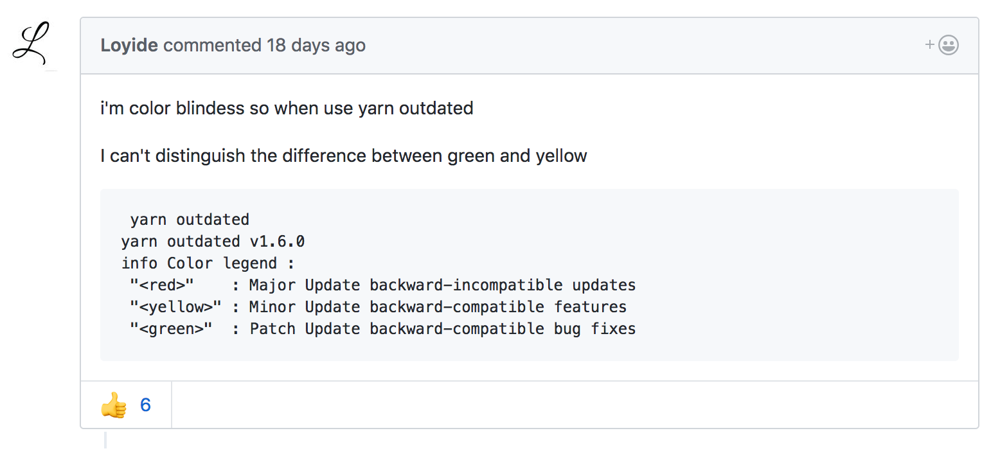
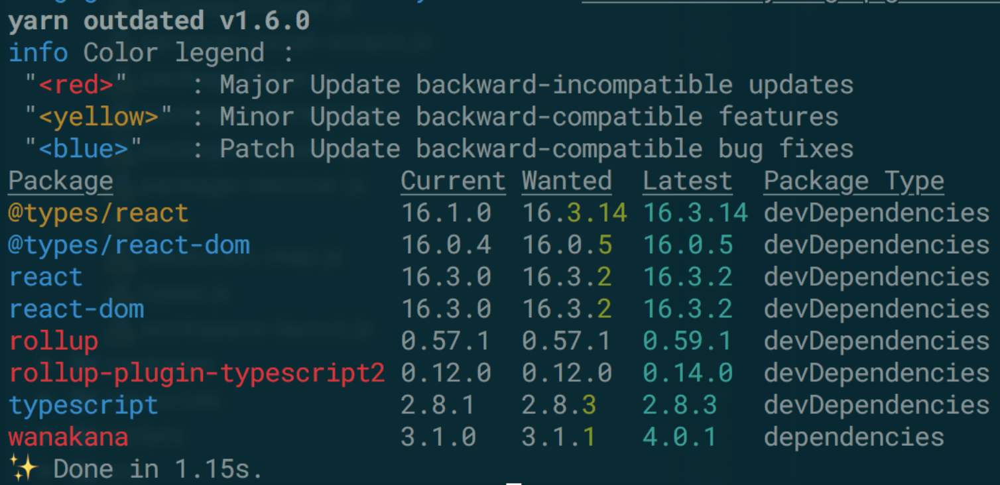
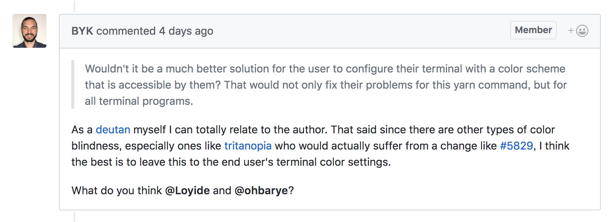

## エンジニアも気にしたい
## 色のアクセシビリティ

by [@ohbarye](https://github.com/ohbarye) at Roppongi.js#3

---

### Content

- アクセシビリティの領域は多岐にわたるが**色**の話
- web の外側、具体的には CLI の話 <!-- デザイナーには頼れない -->
- 専門家ではないので間違っていたらご指摘ください

---

### きっかけ

[yarnpkg/yarn#5800](https://github.com/yarnpkg/yarn/issues/5800)

---

### どう見えている？

<image src="./color-example.png" width="70%">

[色覚障がいのある人に配慮した色使いのガイドライン](http://www.pref.osaka.lg.jp/attach/14768/00000000/guide1.pdf)より

---

### yarn outdated

<image src="./yarn-outdated.png" width="90%">

色で Major/Minor/Patch を表現
<!-- upgrade-interactive でも同じ -->

---

### どうすればよい？

> For people like me, red, yellow and blue are much better combinations than red, yellow, and green combinations.
> So I would like to recommend the blue family!

[yarnpkg/yarn#5800 (comment)](https://github.com/yarnpkg/yarn/issues/5800#issuecomment-387946810)

---

### やってみた

[yarnpkg/yarn#5829](https://github.com/yarnpkg/yarn/pull/5829)

---

### 新たな問題

第3色覚異常にとっては前述の変更が問題になる

>>>

- deutan: 第2色覚異常. 緑を感じる視細胞に異常
- tritanopia: 第3色覚異常. 青を感じる視細胞に異常

参考: [色覚の原理と色盲のメカニズム](https://www.nig.ac.jp/color/barrierfree/barrierfree1-5.html)

---

### 結局

> I think the best is to leave this to the end user's terminal color settings.

利用者のターミナル設定に委ねるのがベスト...?

---

### 色の使用に関するガイドライン

ガイドライン兼国際標準規格である WCAG の記述

> 色が、情報を伝える、動作を示す、反応を促す、又は視覚的な要素を判別するための唯一の視覚的手段になっていない。 (レベル A)

[WCAG 2.0 解説書](https://waic.jp/docs/UNDERSTANDING-WCAG20/visual-audio-contrast-without-color.html)より

>>>

### JIS では？

日本工業規格では「JIS X 8341-3：2016」がある

> JIS X 8341 という番号は、「8341＝やさしい 」という意味でつけられました。

出典: http://jis8341.net/wakaru_sample.pdf

---

### 気にする必要ある？

- 日本人男性の約5％
- 日本人女性の約0.2%

[日本眼科学会ホームページ](http://www.nichigan.or.jp/index.jsp)より

他人事ではない！

---

## まとめ

- 情報を伝える唯一の手段が色にならないように
- CLI でもアクセシビリティに配慮する
- もちろん web でも

---

### Who?

<!-- 時間があれば -->

<image src="./me.jpeg" width="20%">
***

- @ohbarye http://ohbarye.me/
- Web Developer / Engineering Manager
- Working for [Quipper](https://www.quipper.com/) (we're hiring!) <!-- 最近目黒に引っ越し -->
